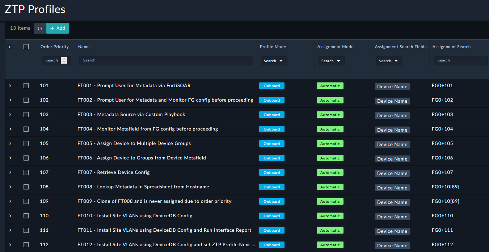
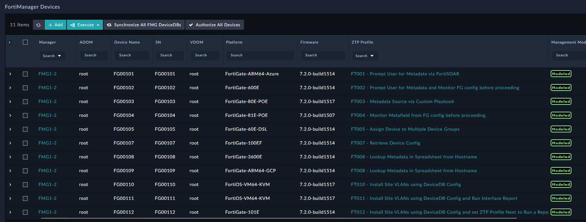
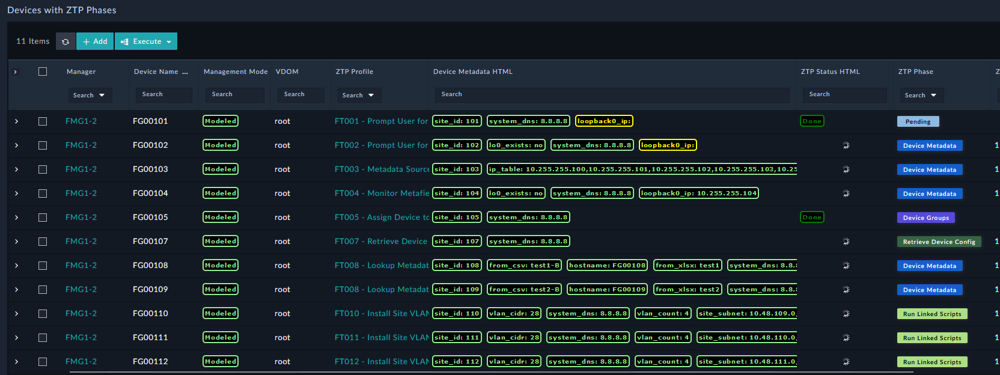
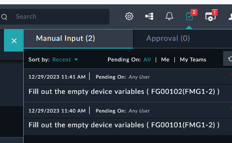
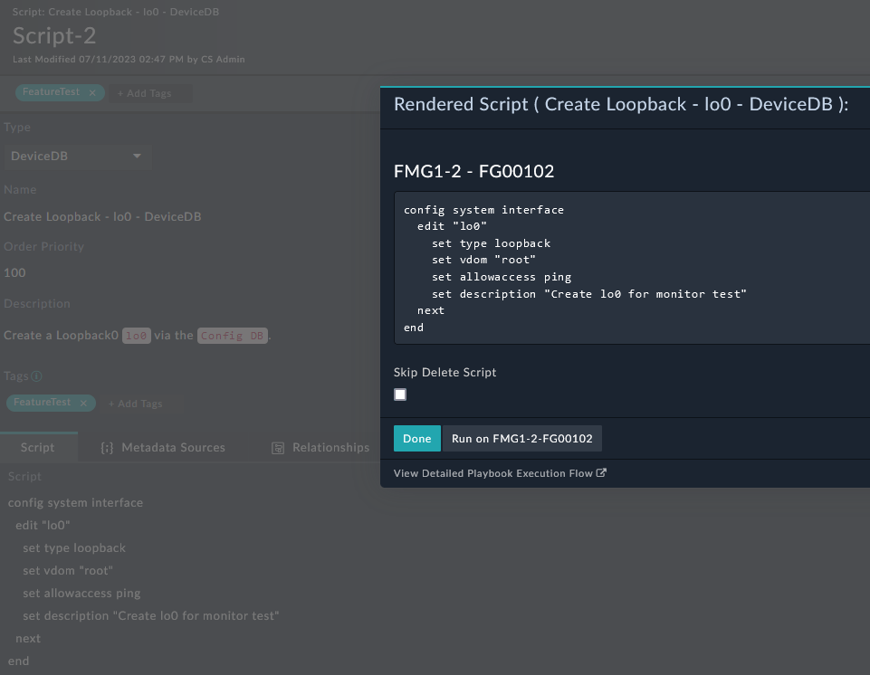

| [Home](../README.md) |
|----------------------|

# Usage

This solution pack provide various examples of ZTP Profiles that can be used to test some common features needed in building an automation solution. You can use the automatic assigning of these profiles by creating devices matching the names already put in the ZTP Profile `Assignment Search` or you can manually assign a profile to one or more devices to perform the feature test. 



## Setup FMG for Feature Tests

To create random test devices in FMG leverage the Manager automation `Device Model - Create Randomly` and when prompted for `Range of Devices` enter `101-112`. 


Once the devices show in the system the ZTP Profile will automatically be assigned and ZTP Phases will kick off. 


The Dashboard `ZTP Profile and Phase for Devices` then shows what stage the device is in for ZTP phases. 


## ZTP Profile Details

### User Input via FortiSOAR

The Profiles **FT001** and **FT002** both request FortiSOAR users for metafield input. 




### Monitoring for FG Config via FMG API

The Profiles **FT002** and **FT004** are monitoring for the existence of the `lo0` interface. 


The search for `lo0` is done using Jinja Template that searches the results of `/pm/config/device/\{\{record.devname\}\}/global/system/interface` using this script:
```



  



{{md}}
```

This can be created anyway you like, the commands are simply:
```
config system interface
  edit "lo0"
    set type loopback
    set vdom "root"
    set allowaccess ping
    set description "Create lo0 for monitor test"
  next
end
```

You can use FortiSOAR to run scripts arbitrarily. In FortiSOAR and `FortiManager -> Scripts` you can open the record `Create Loopback - lo0 - DeviceDB` and run the `Render Script with a Device` automation. This will provide you with the CLI you need to create the Loopback and you can run this via the FMG API. If you want to see the script created in FMG then check the `Skip Delete Script` option and go check FortiMnager. 



Once this is done the ZTP Profile should complete monitoring. 
